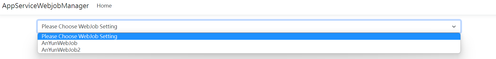
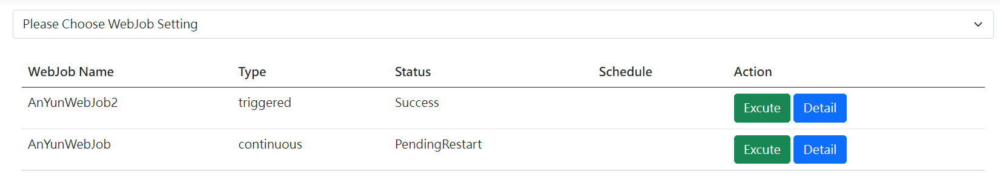
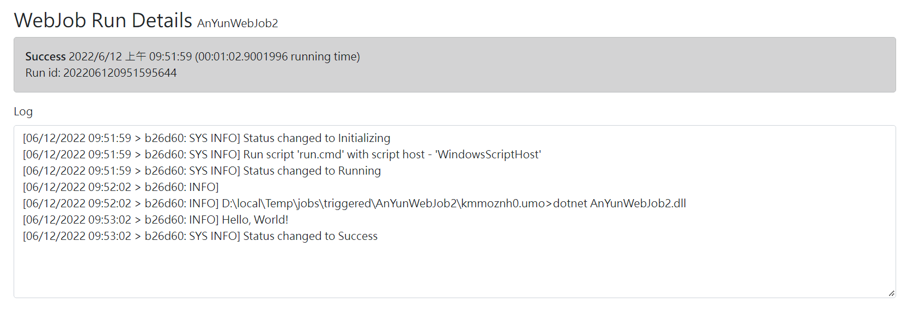
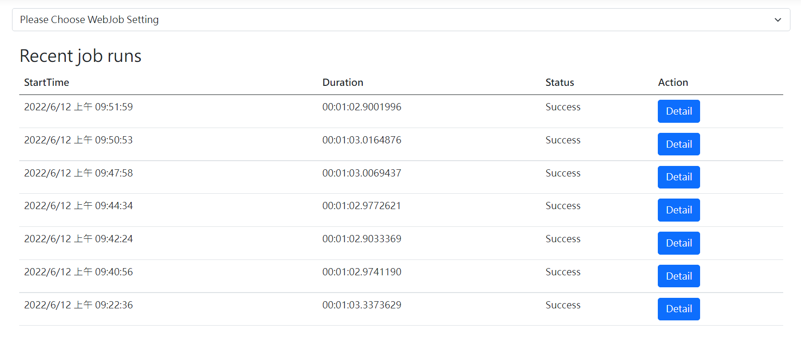
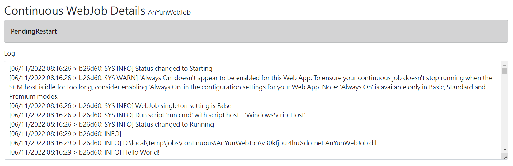

# AppServiceWebjobManager #

本專案為 App Service WebJob 管理平台，可以透過本平台來管理 WebJob，目前可以透過平台來執行和察看 WebJob 執行的狀態和記錄，也支援管理多組 App Service 設定，更多使用說明可以參考部落格文章「[透過 Kudu API 實做 App Service WebJob 管理平台](https://dotblogs.com.tw/anyun/2022/06/12/205845)」。

# 其它 #

開發環境：

Visual Studio 2022

.Net 6

# License #
[Mit License](http://opensource.org/licenses/mit-license.php)

**by AnYun - [https://dotblogs.com.tw/anyun/](https://dotblogs.com.tw/anyun/)**